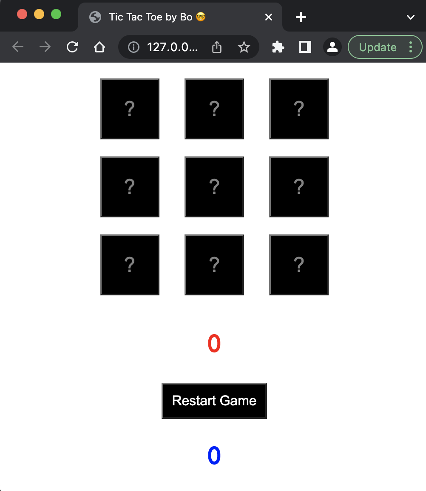
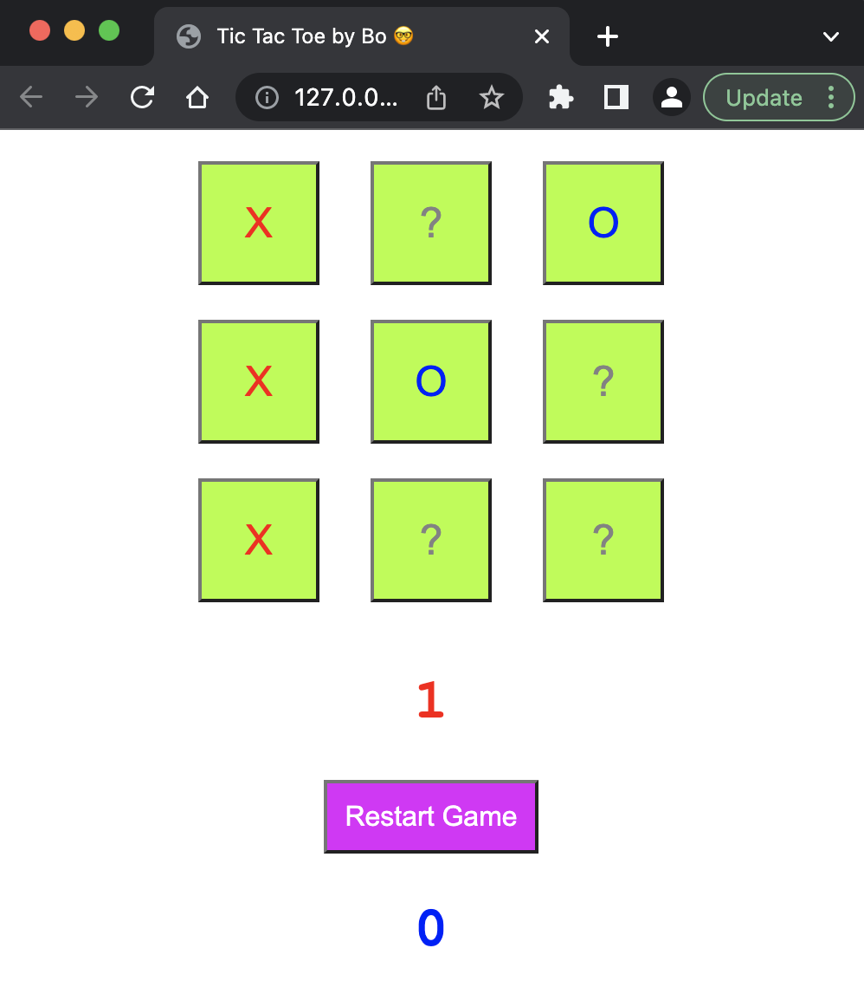

# Tic-Tac-Toe Game

A simple single-player Tic-Tac-Toe game built using HTML, CSS, and JavaScript, where you can play against a basic AI.

## Features

- Play against a basic AI.
- Reset button with different states depending on the board's activity.
- Score tracking for each player.

## How to play

1. Clone the repository or download the source code.
2. Open `index.html` in your browser.
3. Take your turn as Player X, and the AI will play as Player O.
4. Click on an empty cell to make a move. The game will automatically check for a winner or a draw.
5. Press the reset button to start a new game.

## Screenshots

## License

This project is licensed under the MIT License - see the [LICENSE.md](LICENSE.md) file for details.

